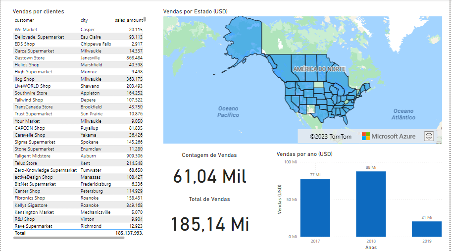

# PIPELINE DE DADOS DE VENDAS

    

## Objetivo
O objetivo deste projeto é desenvolver um pipeline para movimentar um grande conjunto de dados (big data) a partir de uma fonte inicial (_flatfile_) até a apresentação de dashboard para tomada de decisão sobre plataforma Power BI.

### O que é big data
Grandes conjuntos de dados que precisam ser processados e armazenados: 

#### 3 V's 
* **Volume**: Grandes volumes de dados são gerados e armazenados o tempo todo;
* **Velocidade**: Estes dados, em muitos casos, precisam estar disponíveis em curtos periodos de tempo para ter relevância; 
* **Variedade**: Dados de diversas fontes, com vários formatos e estruturas fazem parte do cotidiano do bigdata. 

## _Modelo relacional_ x _Modelo dimensional_
Tradicionalmente, as bases de dados transacionais, que armazenam dados da operação do negócio, são mantidas em SGBDs relacionais como Oracle, MSSql, MySQL ou Postgres. Uma das características deste tipo de bases é a _normalização_, onde o objetivo é evitar a persistência de registros duplicados. 

Por outro lado, nos ambientes de big data, se trabalha com outro paradigma chamado _dimensional_. Neste paradigma, não se procura evitar a duplicidade dos dados, pois o objetivo não é transacional, mas analítico. Assim, o percurso deve ser em sentido inverso: _desnormalizando_ os registros e agrupando os dados em conjuntos maiores que façam sentido para o negócio.   

## O ambiente
Este projeto foi desenvolvido em ambiente linux utilizando a plataforma [gitpod.io](https://gitpod.io/) e o repositório [github](https://github.com/).

### Outras tecnologias necessárias

* [docker](https://www.docker.com/)
* [docker-compose](https://docs.docker.com/compose/)
* [python](https://www.python.org/)
* [pyspark](https://spark.apache.org/docs/latest/api/python/)
* [hadoop](https://hadoop.apache.org/)
* [hive](https://hive.apache.org/)
* [jupyter notebook](https://jupyter.org/)

## Fluxo genérico dos dados


1. Arquivos disponibilizados em diretório _ad-hoc_ ``/raw``. Esta pasta indica uma local de origem externo, que poderia ser também um recurso online, API, etc.
   1. Criação de ambiente: utilizando o script ``01_criacao_ambiente.sh`` é possível configurar o ambiente, criando os diretórios necessários à operação. O nomes dos mesmos e ``paths`` devem ser configurados no arquivo ``config.ini``   
2. Transferência dos arquivos para  o _servidor de borda_, ``/desafio/raw``. Utilizando o script disponível em `` 02_source_to_edge.sh``
3. Transferência dos arquivos para _filesystem_ HDFS, dentro do servidor _Hadoop_ [HDFS ``/datalake/desafio/raw/[pasta_do_arquivo]``], utilizando ``03_transferencia_para_hdfs.sh``
4. Criação de estrutura de tabelas e carga na base relacional _Hive_. O bash ``.\desafio\scripts\pre_process\04_criacao_tabelas_hive.sh`` deve chamar um script python: ``.\desafio\scripts\pre_process\05_criacao_DLLs_dinamicos.py``
5. Desenvolvimento e transformação em tabelas dimensionais e persistência das mesmas no HDFS [``/datalake/desafio/gold/[pasta_do_arquivo]``] 
6. No mesmo script (``07_copia_do_hdfs_para_local.sh``) os arquivos são movidos para novamente para pasta local ``/desafio/gold``, de onde será consumido pelo Power BI.
7. Finalmente, desenvolvimento de dashboard (Power BI) em ``/desafio/app/Projeto Vendas.pbix``, esta implementação utiliza as tabelas dimensionais disponibilizadas em ``/desafio/gold`` 
   
## Estrutura de arquivos
```
root
|
+ desafio
+- raw
    +- vendas.csv
    +- ...
+- gold
    +- ft_vendas.csv
    +- ...
+- app
    +- Projeto Vendas.pbix
+ raw
   +- VENDAS.csv
+ scripts
   +- 01_criacao_pastas.sh
   +- pre_process
         +- pyton
   +- process
         +- python
   +- hql
      +- create_table_...hql
```

### Scripts 
Os scripts do projeto podem ser encontrados em [``/desafio/scripts``](desafio/scripts/)

|Arquivo|Diretório|Tipo|Obs
|----|----|---|---
|config.ini|``/desafio/scripts``|ini file|Definição das variáveis do projeto
|01_criacao_ambiente.sh|``/desafio/scripts``|bash|Criação dos diretórios necessários para o projeto
|02_transferencia_para_edge_node.sh|``/desafio/scripts``|bash|Movimentação do arquivos externos para o _filesystem_ (neste caso apenas uma pasta) dentro do ambiente do projeto
|03_transferencia_para_hdfs.sh|``/desafio/scripts``|bash|Movimentação do do _filesystem_ para o _datalake_ HDFS
|04_criacao_tabelas_hive.sh|``/desafio/scripts/pre_process``|bash|Este arquivo dispara um script ``python`` que cria dinamicamente os DLLs e enseguida utiliza estes para criar as tabelas do sistema.  
|05_create_table_DLLs.py|``/desafio/scripts/pre_process``|python|Este script desenvolve de forma dinámica os DLLs para criação das tabelas dentro do Hive.
|06_process.py|``/desafio/scripts/process``|python|Este arquivo realiza as transformações necessárias nos dados das tabelas Hive e cria os arquivos dimensionais que servirão como base para a montagem do dashboard final. 
|07_copia_do_hdfs_para_local.sh|``/desafio/scripts``|bash|Script que roda o python mencionado acima e movimenta os arquivos que foram criados no HDFS para o diretório local ``/desafio/gold``

## Passo a passo

### 1. Criação dos diretórios do projeto
O primeiro script a ser executado deve criar todos os diretórios necessários para a implementação do sistema.  

```
$ cd desafio/scripts
$ bash 01_criacao_ambiente.sh
``` 

### 2. Movimentar os arquivos fonte
Após a criação dos diretórios, o processo inicia com um conjunto de arquivos na pasta ``/raw`` (esta pasta está na raíz do projeto e não é a mesma onde serão enviadas as fontes dedados). 

(*) _A origem das informações. Arquivos csv disponíveis em diversas fontes: csv online, zipfile local, etc_

#### Fontes de dados
|Tabela|Formato|Tamanho|Detalhes|
|------|-------|-------|--------|
|VENDAS|csv|10.83GB|Informações de vendas, preços, descontos, etc
|CLIENTES|csv|46.72MB|Informações dos clientes, esta entidade permite o relacionamento com as outras 3 (a seguir)
|ENDERECO|csv|77.87MB|Informações do endereço ligada aos clientes e necessária para a tabela dimensional de localidade. 
|REGIAO|csv|0.10MB|Região da localidade 
|DIVISAO|csv|0.05MB|Divisão da localidade

(*) _Filesystem com os dados crus, não processados. É o primeiro estagio onde os arquivos são colocados dentro do fluxo._

#### Movimentação dos arquivos para o _servidor de borda_
O primeiro passo deste processo será movimentar os arquivos da fonte, que poderiam estar em outro servidor ou formato, para a primeira pasta do servidor local. Chamaremos esta pasta de _servidor de borda_, já que entendemos que será o local de entrada das nossas informações.

* Arquivo ``/desafio/scripts/config.ini``: utilizamos um arquivo centralizado contendo as variáveis que serão utilizadas no projeto. Decidimos pela utilização deste formato já que atende tanto os scripts do tipo ``bash``, quanto ``python`` 
* Arquivo ``/desafio/scripts/02_transferencia_para_edge_node.sh``: este primeiro script recupera o nome das entidades (arquivos) que se encontram na pasta de origem e itera o nome de cada um deles realizando 2 ações principais: 
       
   1. Mover o arquivo para a pasta informada
   2. Alterar o nome dos arquivos para lowercase

Para rodar o script deve executar: 
```
$ cd /desafio/scripts
$ bash 02_transferencia_para_edge_node.sh
```

O resultado desta operação deve ser a cópia dos arquivos no diretório ``/desafio/raw`` 

### 3. Movimentação de arquivos para HDFS
O segundo passo será movimentar os arquivos recebidos para o servidor HDFS que está conteinerizado (docker ``namenode``).

Para realizar esta operação será necessário executar:
```
$ cd /desafio/scripts
$ bash 03_transferencia_para_hdfs.sh
``` 

...que fará a seguinte operação:

Os arquivos serão movimentados para a pasta HDFS ``/datalake/desafio/raw`` 
   
(*) _Arquivos são transferidos a uma pasta dentro do datalake HDFS. Assim como no ponto 2, a pasta raw conterá os arquivos sem tratamento._

### 4. Criação dinámica de DLLs

Uma vez que as informações estejam disponíveis no servidor HDFS, será o momento de criar os DLLs para as tabelas. 

Através de um script ``python``, será lido cada um dos arquivos e extraído deles os cabeçalhos com o nome das colunas. Com esta informação, será criado - para cada tabela - script de criação ``hql`` que posteriormente será chamado através de um comando *beeline* no ``hive``. 

Estes scripts podem ser encontrados na pasta ``/desafio/scripts/hql/create_table_[nome_da_tabela].hql`` 

Para executar este script: 

```
$ cd /desafio/scripts
$ bash 04_criacao_tabelas_hive.sh
```

### 5. Criação de tabelas
Com as informações no servidor Hadoop e as DLLs criadas, já é possível executar a criação das bases, tabelas e carga dos dados. 

Para realizar esta operação, o script ``/desafio/scripts/pre_process/04_criacao_tabelas_hive.sh`` deve, mas uma vez, recuperar os nomes de todas as tabelas e processar para cada uma delas, a criação das tabelas externas e gerenciadas, assim como realizar a vinculação das mesmas a partir dos arquivos já mencionados. Este script, dispara o início do ``05_criacao_DLLs_dinamicos.py``, na mesma pasta, que cria dinamicamente as tabelas.  

Para executar este script:

```
$ cd /desafio/scripts/pre_process
$ bash 04_criacao_tabelas_hive.sh
```

O resultado destas operações deve apresentar a seguinte estrutura no Hive (*):

1. Dois bancos de dados: ``desafio_db_ext`` e ``desafio_db_stg``; 
2. Para cada um destes bancos teremos as tabelas ``tbl_vandas; tbl_clientes; tbl_endereco; tbl_regiao; tbl_divisao``

(*) _Banco de dados relacional dentro do ambiente Hadoop. Após as tabelas criadas, os dados são inseridos nessa estrutura._

#### Diagrama relacional


### 6. Tratamento dos dados e persistência de tabelas dimensionais
Com todos os dados consolidados na base, devemos transforar os dados, seguindo os critérios: 
1. Strings vazias ou nulas = "Não informado";
2. Números nulos = 0

Para realizar esta operação devemos rodar script ``python`` no ambiente ``pyspark``. Realizaremos as seguintes operações:

#### Tratamento dos campos de tipo texto

```python
# tratar campos em branco ou nulos
ni = "Não Informado"
campos_string = ["address_number", "city", "state", "country", "customer"]

for c in campos_string:
    df_stage = df_stage.withColumn(c, regexp_replace(col(c), "\s{2,}", ni)) \
        .withColumn(c, when(col(c).isNull(), ni).otherwise(col(c))) \
        .withColumn(c, when(col(c) == '', ni).otherwise(col(c)))
    
```
#### Tratamento dos campos de tipos numéricos
```python
# Tratamento dos campos numéricos (nulos p zero e formato ok)
campos_num = ["list_price", "sales_amount", "sales_amount_based_on_list_price", \
              "sales_cost_amount", "sales_margin_amount", "sales_price"]

for c in campos_num:
    df_stagea = df_stage.withColumn(c, regexp_replace(col(c), ",", "")) \
        .withColumn(c, regexp_replace(col(c), ",", ".")) \
        .withColumn(c, col(c).cast("float"))
```

#### Tratamento dos campos data
```python
# Cast campos data
campos_data = ["invoice_date"]
cast_date_udf =  udf(lambda x: cast_date(x), DateType())  

for data in campos_data:
    df_stage = df_stage.withColumn(data, cast_date_udf(col(data)).alias(data))
```

Este script deve ser executado dentro do container ``docker``:

``$ docker exec jupyter-spark /opt/spark-2.4.1-bin-without-hadoop/bin/spark-submit /desafio/scripts/process/process.py`` 

O resultado desta implementação deve colocar, na pasta ``/datalake/desafio/gold/[nome_da_tabela]`` do HDFS, cada uma das informações dimensionais, que diferente das tabelas relacionais do Hive, estão _desnormalizadas_ e devem ser montadas como mostrado na figura abaixo. 

#### Diagrama Dimensional


|Tabela|Obs|
|-|-|
|FT_VENDAS|Tabela fato com os dados de vendas|
|DIM_CLIENTES|Dimensão de clientes com a informação do nome|
|DIM_LOCALIDADE|Dimensão com informações geográficas como Estado, cidade ou país|
|DIM_TEMPO|A dimensão de tempo, a través da data de fatura, foi extraído ano, mês e trimestre. |

As informações dimensionais, geradas através do script 

### 8. Exportação para o servidor local
A partir dos dados dimensionais, deve ser executado o script ``07_copia_do_hdfs_para_local.sh`` para disponibilizar as informações na pasta ``/desafio/gold`` de onde poderão ser consumidas pelo _cliente_ (Power BI).

### 9. Power BI
Na pasta ``/desafio/app`` encontramos o arquivo ``Projeto Vendas.pbix`` que implementa a consulta dos campos dimensionais da pasta ``/desafio/gold`` e apresenta um dashboard com as seguintes informações: 

* Indicadores de quantidade de vendas
* Vendas por cliente
* Vendas por ano
* Vendas por estado
* Valor total de vendas

#### Captura do dashboard implementado
